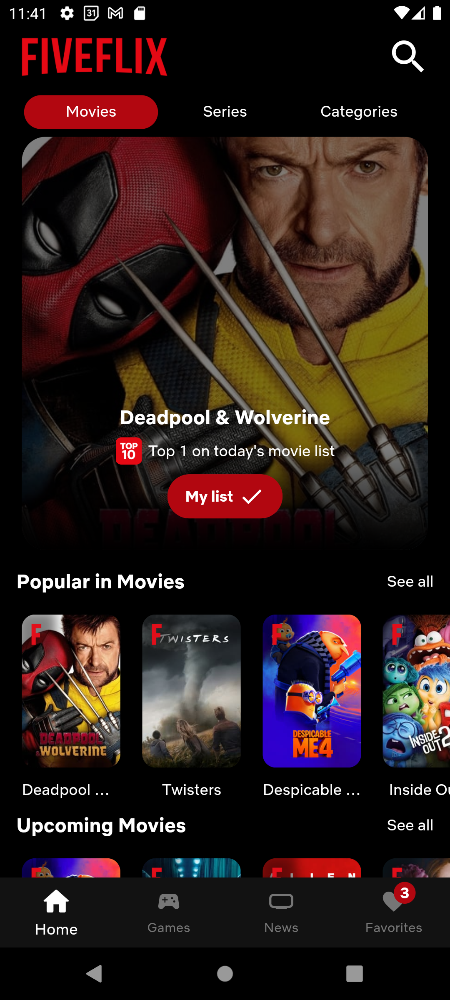
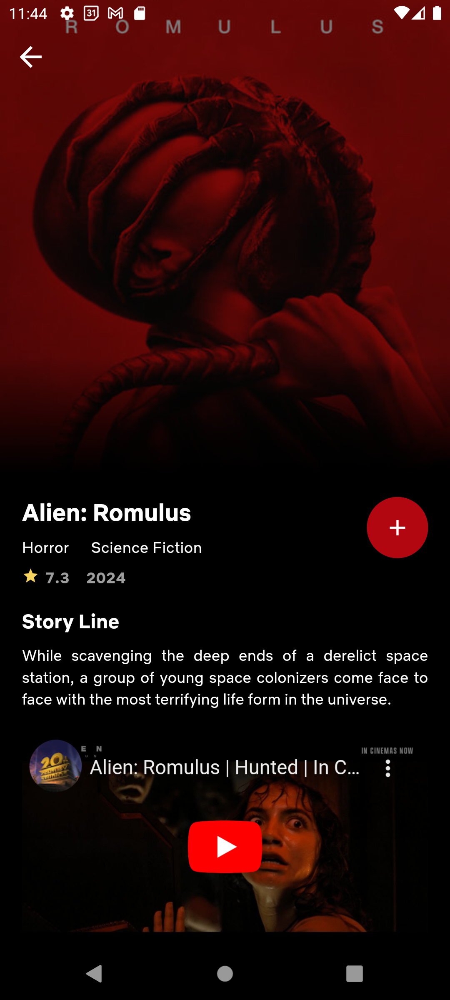
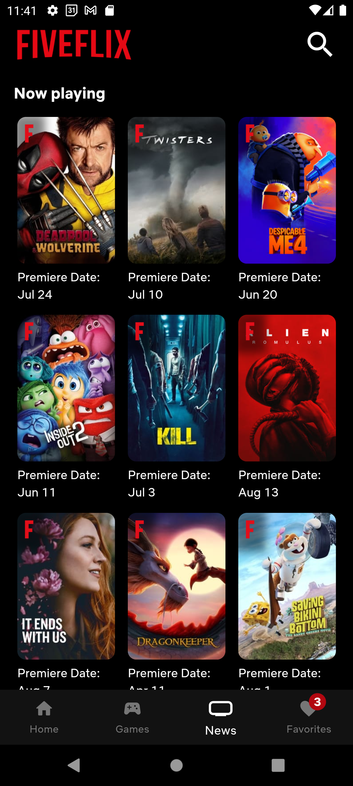
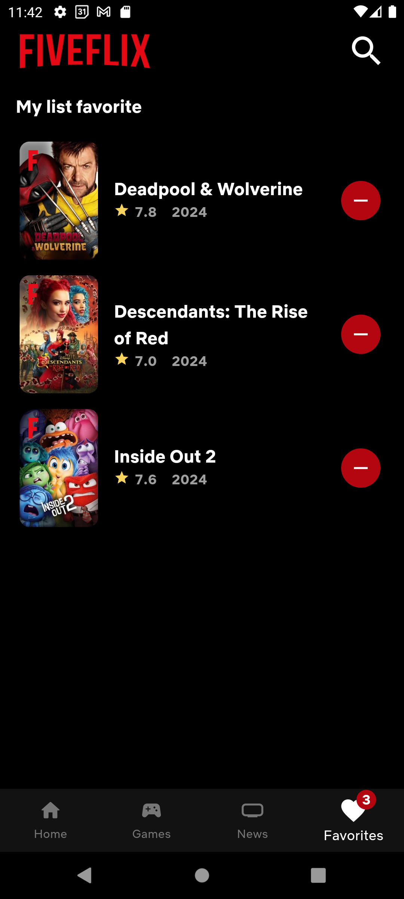

# 🎥 Fiveflix

Este projeto Flutter utiliza a vasta base de dados da API do [The Movie Database](https://www.themoviedb.org/documentation/api?language=pt-BR) para exibir filmes e séries populares e seus últimos lançamentos. O gerenciamento do estado da aplicação é feito com o BLoC, um padrão de arquitetura que facilita a criação de interfaces reativas e previsíveis.

<p> Alimente sua curiosidade e deixe-se envolver pela vasta gama de opções, ajudando você a escolher sua próxima aventura cinematográfica.</p>

## 🖼️ Screenshots

<p>




</p>

## 💻 Tecnologias utilizadas

- Flutter
- API The Movie Database (TMDB)
- Bloc

## 📱Executando o aplicativo

1. Obtenha os Pacotes Necessários

```dart
flutter pub get
```

2. Obtenha uma Chave de API do [TMDB](https://www.themoviedb.org/documentation/api) e substitua a chave de API em `lib/utils/fiveflix_strings.dart`

```dart
static const apikey ='INSERT_YOUR_API_KEY_HERE';
```

3. Run App

```dart
flutter run
```

## 🚀 Team

|                                                                                      Alexandre                                                                                       |                                                                                         Andrea R                                                                                         |                                                                                  Evelyn V                                                                                   |                                                                               Jusy L.                                                                                |                                                                               Lucas Noc                                                                               |                                                                              Núbia B                                                                              |                                                                                           Petronio                                                                                           |                                                                                           Vinicius                                                                                            |                                                                                      Willian                                                                                      |
| :----------------------------------------------------------------------------------------------------------------------------------------------------------------------------------: | :--------------------------------------------------------------------------------------------------------------------------------------------------------------------------------------: | :-------------------------------------------------------------------------------------------------------------------------------------------------------------------------: | :------------------------------------------------------------------------------------------------------------------------------------------------------------------: | :-------------------------------------------------------------------------------------------------------------------------------------------------------------------: | :---------------------------------------------------------------------------------------------------------------------------------------------------------------: | :------------------------------------------------------------------------------------------------------------------------------------------------------------------------------------------: | :-------------------------------------------------------------------------------------------------------------------------------------------------------------------------------------------: | :-------------------------------------------------------------------------------------------------------------------------------------------------------------------------------: |
|                        <a href="https://github.com/AlexandreCalmonJr"></a><br />                        |                              <a href="https://github.com/devdados"></a><br />                              |                    <a href="https://github.com/evelyn-vanielly"></a><br />                     |                    <a href="https://github.com/jusylopes"></a><br />                    |                     <a href="https://github.com/Lucasnoc"></a><br />                     |               <a href="https://github.com/nubiabarcellar"></a><br />                |                               <a href="https://github.com/petronio50"></a><br />                               |                             <a href="https://github.com/viniciusjsouza"></a><br />                              |                        <a href="https://github.com/WillianSeidel"></a><br />                        |
| <a href="https://www.linkedin.com/in/alexandre-calmon-54ab7016a/"></a> | <a href="https://www.linkedin.com/in/andr%C3%A9a-rangel-011826245/"></a> | <a href="https://www.linkedin.com/in/evelyn-vanielly/"></a> | <a href="https://www.linkedin.com/in/jusy-lopes/"></a> | <a href="https://www.linkedin.com/in/nocfidback/"></a> | <a href="https://www.linkedin.com/in/nubiaB/"></a> | <a href="https://www.linkedin.com/in/petr%C3%B4nio-oliveira-11899995/"></a> | <a href="https://www.linkedin.com/in/vinicius-de-jesus-souza-ba7a144a/"></a> | <a href="https://www.linkedin.com/in/willianrobertoseidel/"></a> |
